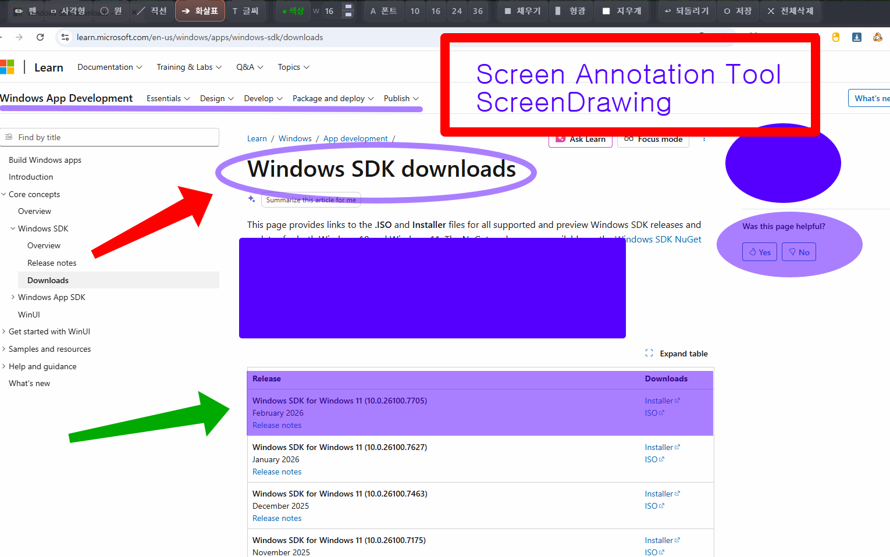

# ScreenDrawIyagi v1.9.0



A **screen annotation and drawing overlay tool** for Windows and Linux.

Pick any color, adjust stroke width, fill shapes, highlight with semi-transparent emphasis, type text in your preferred font, and stamp emoji from a 9-category picker. Undo mistakes, save a snapshot, or clear everything at once.

Use the Drawing ✎ tool to temporarily switch to mouse mode and interact with apps on the desktop, then switch back to drawing mode. Switching with a single click clears your current drawing; switching with a double click preserves it when you return.

The floating toolbar can be dragged anywhere on screen, and your last settings are saved automatically so you're always ready.

---

## ✨ Features

### Drawing Tools
* **Pen** — freehand drawing in any color and width
* **Line / Arrow** — draw straight lines and directional arrows
* **Rectangle / Ellipse** — draw shapes (with optional fill mode)
* **Text** — type directly on screen with configurable font and size
* **Emoji Stamp** — choose from 400+ emoji across 9 categories and stamp anywhere
* **Eraser** — erase specific areas of your drawing
* **Highlighter** — semi-transparent overlay to emphasize screen content
* **Drawing ✎** — temporarily switch to mouse mode to interact with content underneath; single click clears canvas + switches, double click keeps drawing + switches

### Color & Style
* **Color picker** — choose any pen color
* **Stroke width** — adjust line thickness from 1 to 120px
* **Fill mode** — toggle filled rectangles and ellipses
* **Highlighter mode** — highlight existing screen content with transparency

### Emoji Picker
* **9 categories** — Expressions / Hands & Body / Hearts / Animals / Food / Activities / Travel / Objects / Symbols
* **Stamp mode** — click anywhere to stamp the selected emoji in a 3D ink style
* **Text insert** — insert emoji directly into text input while typing

### Convenience
* **Undo** — step back to the previous state
* **Snapshot** — save the current drawing as an image file
* **Clear all** — reset the canvas
* **Floating toolbar** — drag the toolbar anywhere on screen
* **Settings persistence** — last used color, width, font, and tool are saved automatically

---

## 🎮 Keyboard Shortcuts

| Key | Action |
|---|---|
| Ctrl + Z | Undo |
| Ctrl + S | Save (transparent PNG) |
| Ctrl + Q | Exit |
| C | Clear canvas |
| ESC | Exit (or cancel text input if active) |
| Hold Ctrl | Temporary eraser (restores on release) |
| Hold Shift | Temporary straight line (restores on release) |
| Ctrl + Enter | Confirm text (draw on canvas) |

**Drawing ✎ tool** — single click clears canvas then switches, double click switches while keeping your drawing.

---

## ⬇ Download

### Windows
Install from the Microsoft Store.
(Store link coming soon)

### Linux
Download the binary from GitHub Releases.

```bash
chmod +x ScreenDrawIyagi
./ScreenDrawIyagi
```

---

## 🐧 Linux Setup

Qt6 platform plugins are required.

```bash
sudo apt install libqt6widgets6 libqt6-xcb-private-plugins
```

Emoji font (if not already installed):

```bash
sudo apt install fonts-noto-color-emoji
```

On Wayland, the app runs automatically via XWayland.

---

## 🖥 Supported Platforms

* Windows 10 / 11
* Linux (GNOME Wayland / X11)

---

## 👤 Author

IYAGI INC
Email: [iyagicom@gmail.com](mailto:iyagicom@gmail.com)
GitHub: https://github.com/iyagicom

---

## 📜 License

Copyright (c) 2026 IYAGI INC. All rights reserved.

This software is provided as **executable files only**. Source code is not publicly available.

You may use this software for personal and non-commercial purposes.
Redistribution, modification, or reverse engineering is prohibited without explicit written permission from the author.
