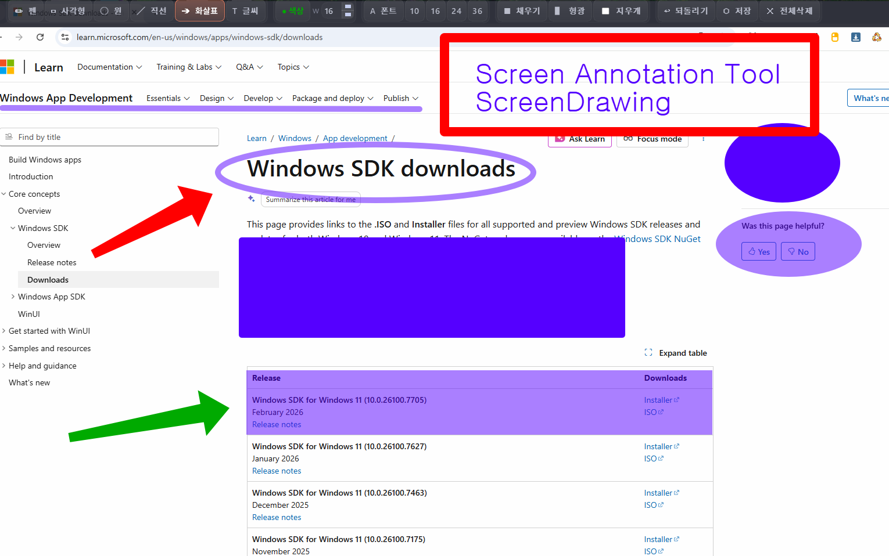
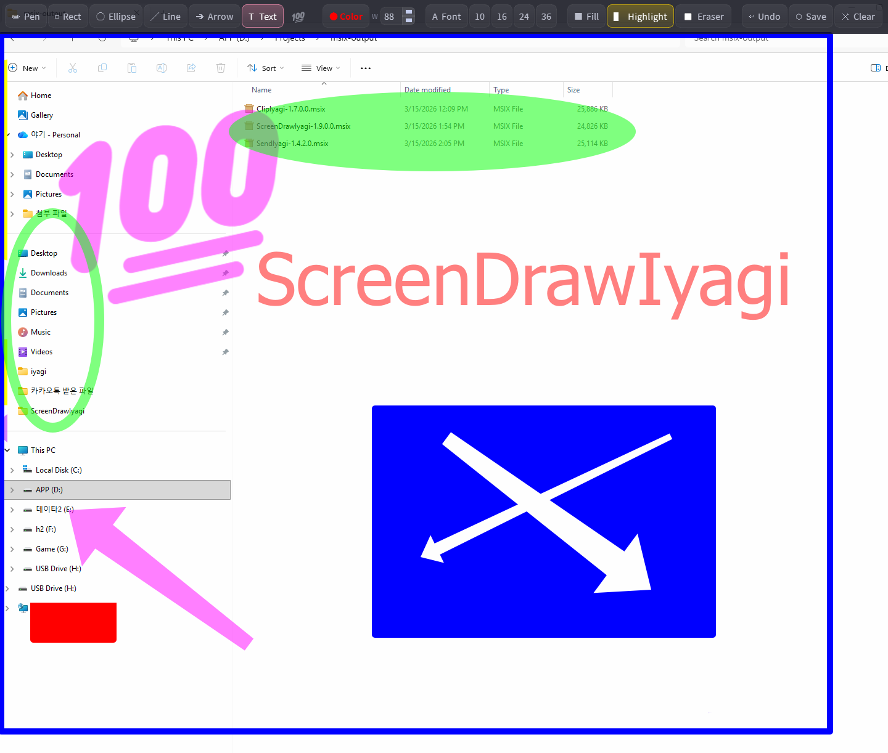

# 스크린드로우이야기 (ScreenDrawIyagi)

**화면 위에 바로 그립니다 — 동그라미 치고, 가리키고, 형광펜으로 칠하고. 발표·수업·화면 공유용. Windows·Linux.**

[English](README.md) · [한국어](README_ko.md)



## 왜 스크린드로우이야기인가

- **말하는 곳을 정확히 짚습니다.** 어떤 앱·슬라이드·영상 위에든 펜·화살표·상자·형광펜을 긋습니다. "어디요?" 라는 질문이 없어집니다.
- **그리다가 바로 클릭.** 한 번 누르면 마우스로 돌아가 아래 앱을 조작하고, 다시 이어서 그립니다.
- **라이브에서 빠르게.** `Ctrl` 을 누르고 있으면 지우개, `Shift` 를 누르고 있으면 직선, `Ctrl+Z` 되돌리기, `C` 한 번에 지우기.
- **눈에 띄는 도장.** 9개 분류 400개가 넘는 이모지를 클릭 한 번으로 찍습니다.
- **그린 것은 남깁니다.** 투명 PNG 로 저장합니다.
- **Wayland 에서도.** 리눅스 GNOME Wayland·X11, Windows 10/11.

## 기능

- 펜, 직선, 화살표, 사각형, 원(채우기 가능), 글자, 형광펜, 지우개
- 이모지 도장 — 9개 분류, 400개 이상
- 원하는 색, 굵기 1~120px
- 어디로든 끌어 옮기는 떠 있는 도구 막대
- 되돌리기, 전체 지우기, 투명 PNG 저장
- 마지막 색·굵기·글꼴·도구 기억



## 다운로드

**[⬇ 최신 버전 받기](https://github.com/iyagicom/ScreenDrawIyagi/releases/latest)**

| 내 시스템 | 받을 파일 |
|---|---|
| Windows 10 / 11 | [Microsoft Store](https://apps.microsoft.com/search?query=ScreenDrawIyagi) |
| Ubuntu 24.04 · 데비안 | **ubuntu24.04** 가 붙은 `.deb` |
| Ubuntu 26.04 | **ubuntu26.04** 가 붙은 `.deb` |
| 페도라 · openSUSE | `.rpm` |
| 아치 · 만자로 | `.pkg.tar.zst` |
| 그 밖의 리눅스 | `.AppImage`(설치 없이 실행) 또는 `.zip` |

```bash
sudo apt install ./screendrawiyagi_*_amd64.deb   # 우분투 / 데비안
sudo dnf install ./screendrawiyagi-*.rpm         # 페도라
sudo pacman -U screendrawiyagi-*.pkg.tar.zst     # 아치
```

## 단축키

| 키 | 동작 |
|---|---|
| `Ctrl+Z` | 되돌리기 |
| `Ctrl+S` | 투명 PNG 로 저장 |
| `C` | 화면 지우기 |
| `Ctrl` 누르고 있기 | 잠깐 지우개 |
| `Shift` 누르고 있기 | 잠깐 직선 |
| `Esc` | 끝내기 |

## 라이선스

[라이선스](LICENSE) · [개인정보 처리방침](privacy-policy.md)
